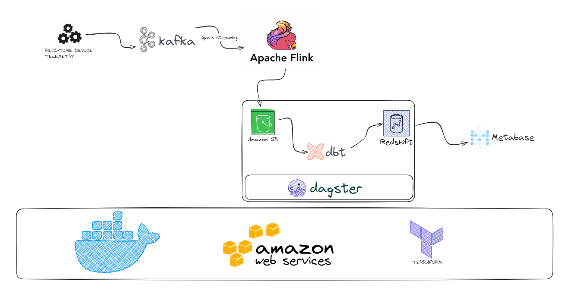

# Streaming on AWS

A data pipeline with Kafka, Amazon EMR, Flink, dbt, Docker, Dagster, Terraform, AWS, and Metabase!

## Description

### Objective

This project streams events generated from a fake music streaming service and creates a data pipeline that consumes real-time data. The data simulates events such as users listening to songs, navigating the website, and authenticating. The pipeline processes this data in real-time using Apache Flink on Amazon EMR and stores it in a data lake periodically. A batch job then consumes this data, applies transformations, and creates tables for our dashboard to generate analytics. We analyze metrics like popular songs, active users, user demographics, and more.

### Dataset

[Eventsim](https://github.com/Interana/eventsim) is used to generate event data that replicates page requests for a fake music website. The results mimic real user data but are entirely synthetic. This project uses a [subset](http://millionsongdataset.com/pages/getting-dataset/#subset) of 10,000 songs from the Million Songs Dataset to generate events.

### Tools & Technologies

- Cloud Platform - [**Amazon Web Services (AWS)**](https://aws.amazon.com)
- Infrastructure as Code - [**Terraform**](https://www.terraform.io)
- Containerization - [**Docker**](https://www.docker.com), [**Docker Compose**](https://docs.docker.com/compose/)
- Stream Processing - [**Apache Kafka**](https://kafka.apache.org), [**Apache Flink**](https://flink.apache.org) on [**Amazon EMR**](https://aws.amazon.com/emr/)
- Orchestration - [**Dagster**](https://dagster.io)
- Transformation - [**dbt**](https://www.getdbt.com)
- Data Lake - [**Amazon S3**](https://aws.amazon.com/s3/)
- Data Warehouse - [**Amazon Redshift**](https://aws.amazon.com/redshift/)
- Data Visualization - [**Metabase**](https://www.metabase.com)
- Language - [**Python**](https://www.python.org)

### Architecture

### Metabase Dashboard

## Acknowledgements

This project was inspired by the Streamify project found [here](https://github.com/ankurchavda/streamify). While the original project used GCP, Airflow, and Spark, this version adapts the concept to an AWS-based stack with Dagster, Flink on EMR, and Metabase. Special effort was made to configure Flink on Amazon EMR, which provides a powerful and scalable environment for stream processing.
